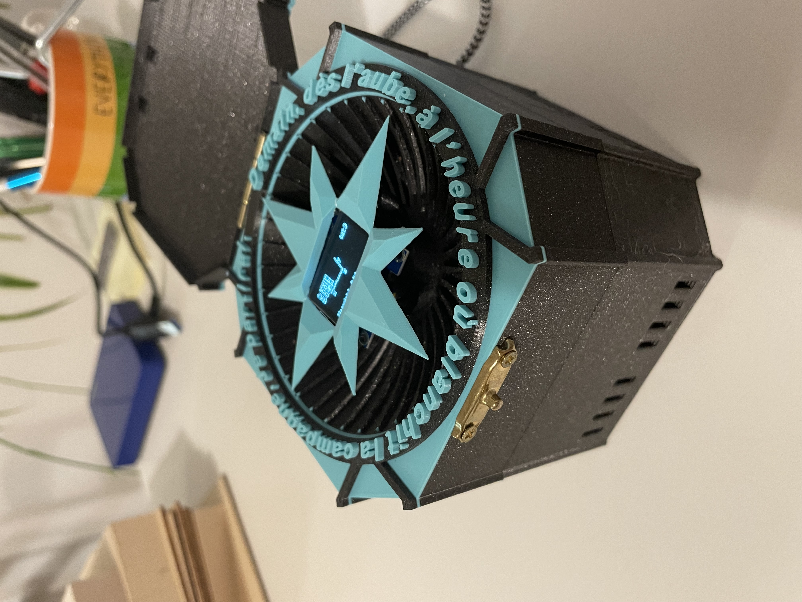
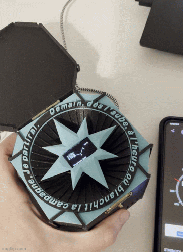
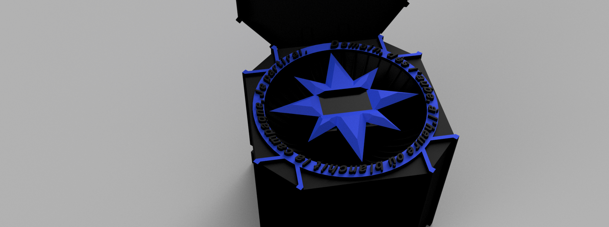
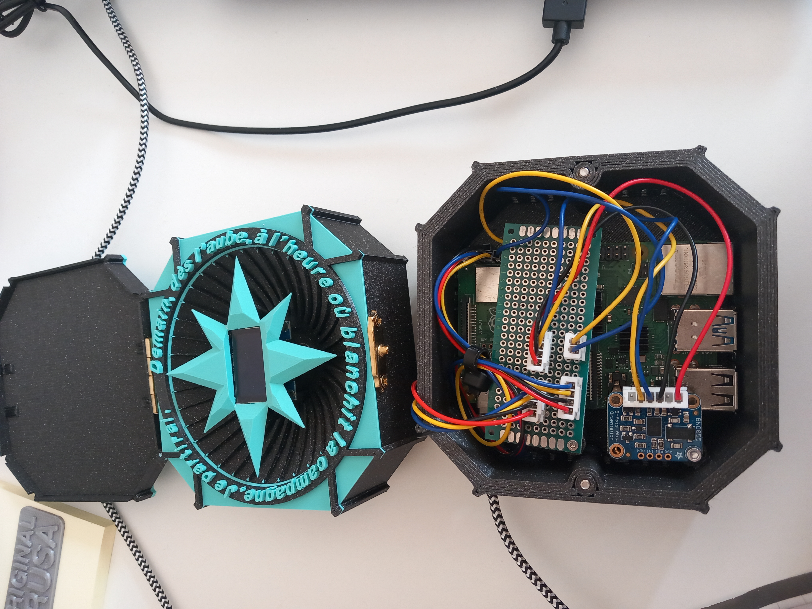
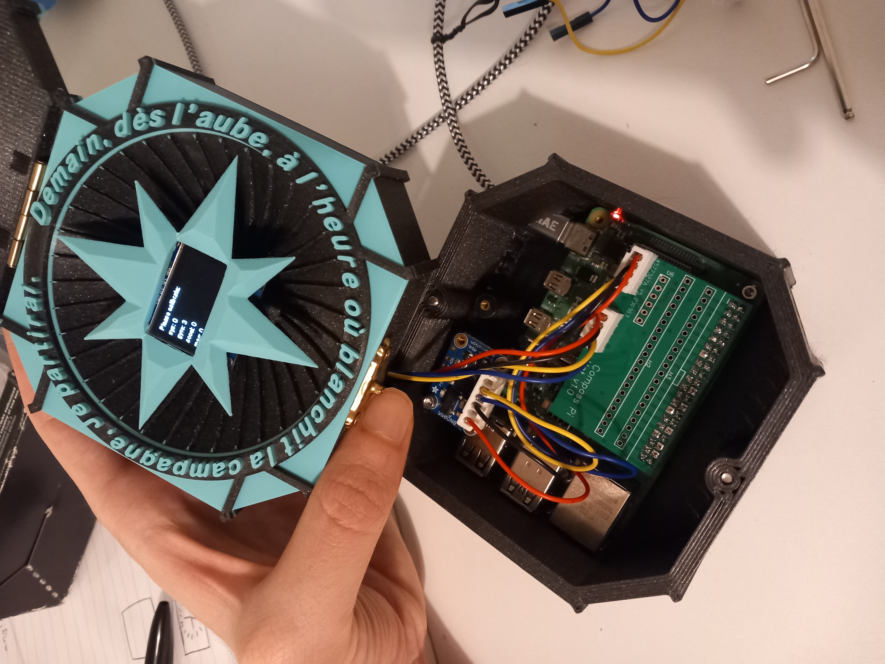
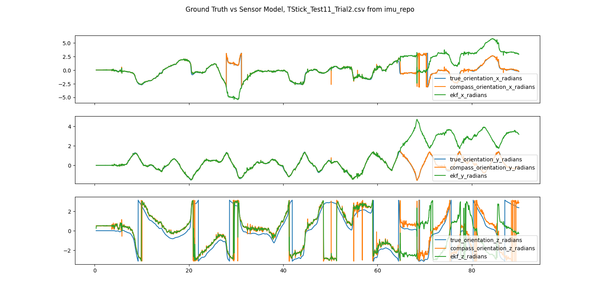
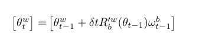
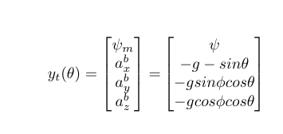

# digital_compass

Firmware, cad, and documentation for my digital compass project. This is a project where I designed, manufactured, and coded a digital compass that uses an inertial measurement unit (IMU) to estimate orientation in 3d-space. I implemented an extended kalman filter to (EKF) to do the estimation.



### Software  
On the software side I separated the project broadly into 3 components:  
* publishing the measurements from the sensor
* estimating orientation from the measurements
* visualizing the orientation


Design considerations:
* modular.
* shared libraries for websockets and message serialization.
* mainly c++.
* for matrix operations compile time checking of dimensions.
* only recreate the wheel for the filter algorithm, for the rest use libraries.
* for filter algorithm, make it possible to try different system models (expanding state matrix to estimate position for example) as well as different filter algorithms (UKF, particle filter, for example). Enter templates.  

To help keep things modular I used docker where each of the 3 components ran in a docker container. They talked to each other through websockets and messages serialized using Google's protobuffer. I used mainly CMake as a build system.  

You can run the package by navigating to the software sub directory and using docker compose to launch the compass.  

On libraries I created:  
* imu_broadcaster -- a repo that talks to the sensor and publishes calibration information, bosch's estimates of orientation, linear acceleration, angular acceleration, magnetic vector, timestamps, and more [here](https://github.com/MZandtheRaspberryPi?tab=repositories).
* imu_filter_cpp -- a repo that implements the system model and an Extended Kalman Filter to estimate orientation from the sensor data and publishes this onward [here](https://github.com/MZandtheRaspberryPi/imu_filter_cpp).
* imu_visualizer -- a repo that listens to our orientation estimate and visualies this on the screen inside of the compass. It projects the 3d coordinate frame onto the 2d screen [here](https://github.com/MZandtheRaspberryPi/imu_visualizer).
* imu_websockets -- a repo that contains wrappers for the third party websocketpp library to easily broadcast and listen, as well as our protobuffer message files and generated libraries [here](https://github.com/MZandtheRaspberryPi/imu_websockets).  
* imu_filter -- a repo to use imu data and ground truth data [[2]](#2) and simulate our model as a proof of concept [here](https://github.com/MZandtheRaspberryPi/imu_filter).
* Adafruit_BNO055 -- a repo I forked from Adafruit's implementation (see below in 3rd party library section) but heavily modified to build using CMake and to run on a raspberry pi instead of an Arduino board [here](https://github.com/MZandtheRaspberryPi/Adafruit_BNO055).  
* imu_adafruit_testing -- a repo to do initial tests that we can get sensor data in docker using some adafruit libraries and using 2 sensors [here](https://github.com/MZandtheRaspberryPi/imu_adafruit_testing).

On third party libraries used:  
* the Eigen3 Library and their Eigen::Matrix class to do linear algebra [here](https://eigen.tuxfamily.org/index.php?title=Main_Page).
* the websocketspp library to setup and send data using websockets [here](https://eigen.tuxfamily.org/index.php?title=Main_Page).
* adafruit libraries to talk to the Adafruit bno055 sensor dev board I used, namely the Adafruit_BNO055 library [here](https://github.com/adafruit/Adafruit_BNO055), though I heavily modified it to run on a raspberry pi instead of an Arduino board. Also the adafruit-circuitpython-ssd1306 library to write to the oled.
* the libi2c-dev ubuntu library to talk to my sensor [here](https://packages.ubuntu.com/jammy/libi2c-dev).

To run this, I used the docker compose file [here](software/docker-compose.yaml).  
```
docker compose up
```

### Design and Manufacturing

I designed the compass using Fusion 360 to look nice, be easily be assembled and disassembled, and be 3d printable. You can find design files in the cad_and_ecad folder.  

Here are some renders I made using Fusion 360 of the CAD:  


  

The design uses threaded inserts to make it easy to assemble and take apart. It also uses a metal brass hinge for the top cover.  

One fun bit was trying to design a part to hold the screen. I wanted a super low profile, and so came up with a design inspired by an alien octopus grabbing the screen cover in a couple places with tentacle arms.  


I also ended up desiging a custom printed circuit board to simplify wiring. Before the custom PCB:  

  

And after:  
  

On the 3d Printing I used multi-color printing by doing a color change at a certain layer. With this I was able to get accent colors I quite liked.

### Maths
A big part of this project was modelling a system that could take measurements from an inertial measurement unit including angular rotation, linear acceleration, and magnetic vector, and estimate orientation. For this, I implemented a model from a 2020 paper by Saito et al, [[1]](#1),  with minimal tweaks. This was actually the first thing I did in this project, where I worked in simulation for some time till I thought I could pull it off in real life. You can see more details in the maths subdirectory and the .pdf write up in that directory [here](https://github.com/MZandtheRaspberryPi/imu_filter/blob/main/write_up/project_writeup.pdf), but briefly I found some data from an IMU including ground truth data [here](https://github.com/agnieszkaszczesna/RepoIMU) [[2]](#2) and played this back in simulation and implemented a model to try and match the ground truth data given sensor measurements. You can see this simulation output below, where it is not perfect and it jumps sometimes, but it is not worlds apart either:  
  

I use an Extended Kalman Filter to model the system and make estimates of my state, which is x rotation, y rotation, z rotation.

To transition from one state at time t=0 to another state at time t=1, see the below. This looks complicated, but really we are taking our prior orientation, and adding the change in orientation to it. We take the angular rotation from our gyroscope, rotate it into our world frame, and then multiply by change in time and add it to our prior estimate:  
  

Our sensor model looks like the below. We have the yaw as calculated from our magnetometer, and then we also have our expected acceleration assuming 0 linear acceleration on the robot, ie just gravity. See [[1]](#1) for detail or the maths subfolder and its repo where a paper is included:  


From here we take the jacobians of each to use in the EKF model, as the system is non-linear we linearize using the jacobians.  


### Bibliography
<a id="1">[1]</a> 
Saito, A., Kizawa, S., Kobayashi, Y. et al. Pose estimation by extended Kalman filter using noise covariance matrices based on sensor output. Robomech J 7, 36 (2020). https://doi.org/10.1186/s40648-020-00185-y


<a id="2">[2]</a>
Szczęsna, A., Skurowski, P., Pruszowski, P., Pęszor, D., Paszkuta, M., & Wojciechowski, K. (2016, September). Reference data set for accuracy evaluation of orientation estimation algorithms for inertial motion capture systems. In International Conference on Computer Vision and Graphics (pp. 509-520). Springer, Cham.